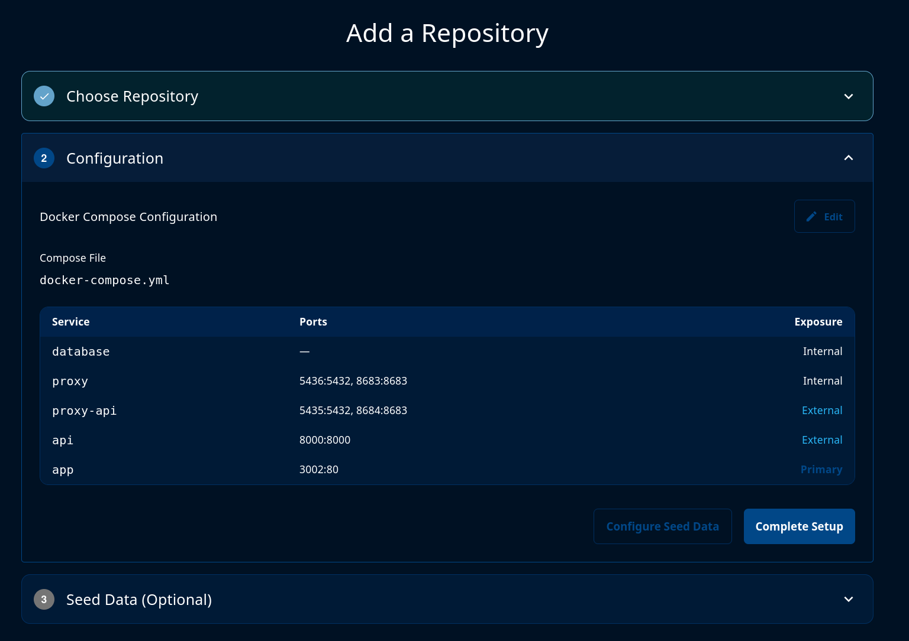
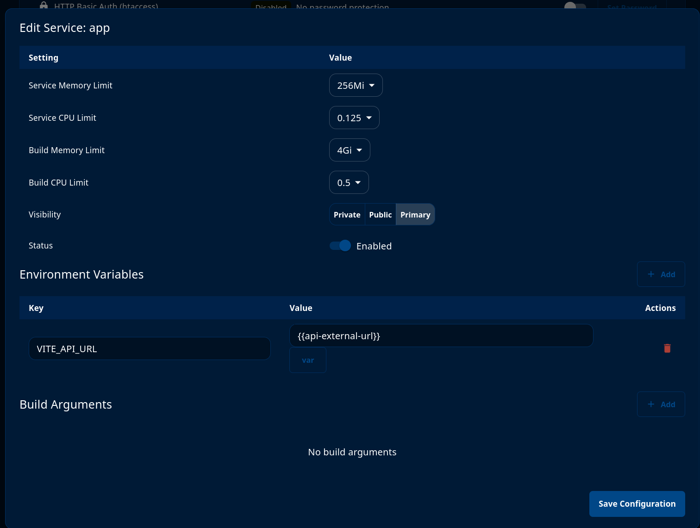

# VeilStream Example
This is an example of how to use VeilStream for a preview environment

## Usage

### 1) fork the repo
### 2) login to ![app.veilstream.com]
### 3) connect the cloned repository to VeilStream at ![app.veilstream.com/onboarding]
### 4) click "Complete Setup"

### 5) click "Deploy from Main"

### 6) go to the 3 dots menu, settings, and update the app container's env var to be `{{api-external-url}}`

### 7) create an environment off your main branch
### 8) wait for the deployment
### 9) review the deployed version of this application

## What this example application is:

It's the chinook dataset used to populate a postgres database, representing a music company. The app container is a react app that is the frontend talking to a simple fastapi api container backed by the postgres database.